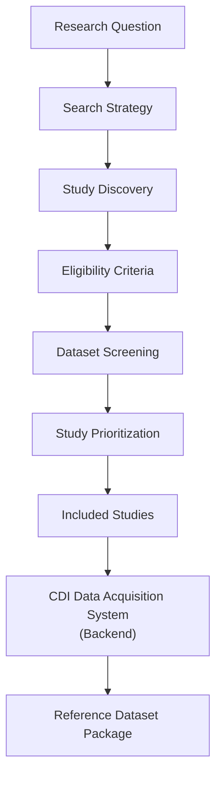

# CDI Systematic Dataset Discovery

A reproducible framework for identifying, screening,
evaluating, and prioritizing public omics studies
before data acquisition.

## CDI Systematic Dataset Discovery Workflow

